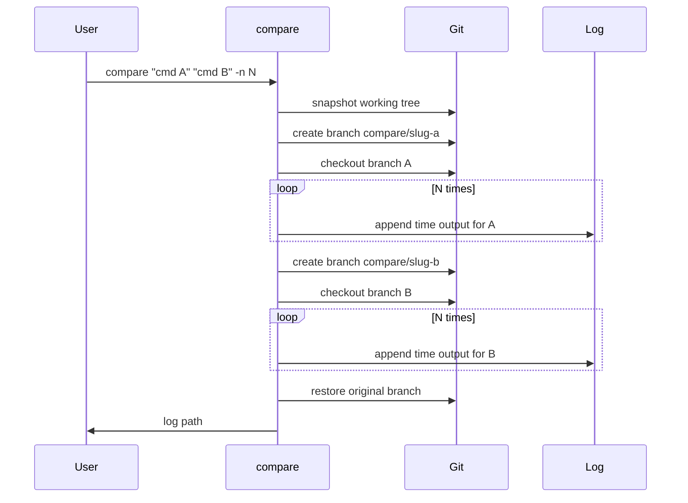

# compare

A git-isolated command benchmarker that records POSIX `time` output for two shell commands so you can compare them fairly.

Running `time cmd-a; time cmd-b` back-to-back is misleading — shared filesystem state, warm caches, and uncommitted changes skew results. `compare` snapshots your repo, runs each command on its own branch from that baseline, and appends timing lines to a log file outside your working directory.

## Contents

- [Prerequisites](#prerequisites)
- [Installation](#installation)
- [Usage](#usage)
- [CLI reference](#cli-reference)
- [Output format](#output-format)
- [How it works](#how-it-works)

## Prerequisites

| Prerequisite | Why |
|--------------|-----|
| Git repository with a clean or commit-able working tree | Creates a snapshot commit and temporary branches |
| POSIX shell (`bash` 4+) | Command execution and `time` builtin |

| Write access to the parent of `--cwd` | Default logs go to `../tests/` relative to cwd |
| [mdr](https://github.com/CleverCloud/mdr) (recommended) | Renders `--md` reports with mermaid SVG support |

Commands are passed as quoted strings and executed via the shell — only compare trusted commands.

## Installation

### From source

```bash
git clone <repo-url>
cd compare
./install.sh
```

This installs `compare` to `/usr/local/bin` (override with `PREFIX=$HOME/.local ./install.sh`).

### Verify installation

```bash
compare --help
```

## Usage

> Examples use `vp exec` — a project-local wrapper that runs tools in a consistent environment. Substitute your own commands (e.g. `npx biome lint`).

**Basic** — two commands, one iteration each:

```bash
compare "echo hello" "echo world"
```

**Repeated sampling** — 100 runs per command:

```bash
compare "vp exec biome format --fix" "vp exec oxlint --fix" -n 100
```

**Custom working directory and log file:**

```bash
compare "npm test" "npm run test:fast" -c ./my-project -o ./results/bench.log
```

**With terminal charts** — plot user, system, CPU, and total time after the run:

```bash
compare "vp exec biome format --fix" "vp exec oxlint --fix" -n 20 --graph
```

**Graph an existing log:**

```bash
compare graph ./results/bench.log
```

**Markdown report** — writes a `.md` file (tables + mermaid charts) and opens it in [mdr](https://github.com/CleverCloud/mdr):

```bash
compare "vp exec biome format --fix" "vp exec oxlint --fix" -n 20 --md
```

Creates `bench.md` alongside `bench.log` (same path, `.md` extension). If [mdr](https://github.com/CleverCloud/mdr) is installed, `compare` runs `mdr bench.md` — GFM tables in the terminal plus mermaid rendered as SVG in mdr's helper window. Without mdr, falls back to `open` (macOS) or `xdg-open` (Linux).

```bash
brew install CleverCloud/misc/mdr
```

## CLI reference

```
compare <command-a> <command-b> [options]
```

### Positional arguments

| Argument | Description |
|----------|-------------|
| `command-a` | Shell command for case A (quote if it contains spaces or flags). |
| `command-b` | Shell command for case B. |

### Options

| Flag | Description | Default |
|------|-------------|---------|
| `-n`, `--number <N>` | Run each command N times on its branch. | `1` |
| `-c`, `--cwd <path>` | Working directory for both commands. | current directory |
| `-o`, `--output <path>` | Log file path. See [Output file naming](#output-file-naming). | see below |
| `-g`, `--graph` | Render terminal line charts after the benchmark | off |
| `--md` | Write a markdown report (`.md`) with tables and mermaid charts, then view with mdr | off |
| `-h`, `--help` | Show help and exit. | — |

### Graph subcommand

```
compare graph <log-file>
```

Reads a compare log file and prints four terminal line charts — **user time**, **system time**, **CPU %**, and **total time** — with one series per command (blue for command A, yellow for command B). X-axis is iteration number.

### Output file naming

When `-o` is omitted, the log is written relative to `--cwd`:

```
../tests/compare-<cwd>-<c1>-<c2>-<endtime>.log
```

| Token | Meaning |
|-------|---------|
| `<cwd>` | Sanitized basename of the working directory |
| `<c1>` | Short slug derived from command A (e.g. `vp-exec-biome-format`) |
| `<c2>` | Short slug derived from command B (e.g. `vp-exec-oxlint`) |
| `<endtime>` | UTC timestamp when the run completed (e.g. `20260617T143022Z`) |

Example: `../tests/compare-my-app-vp-exec-biome-format-vp-exec-oxlint-20260617T143022Z.log`

The `../tests/` directory is created automatically if it does not exist.

## Output format

Each run appends one line. Lines follow the shell `time` builtin format:

```text
<command>  <user>s user <system>s system <cpu>% cpu <elapsed> total
```

Example excerpt from a log file:

```text
vp exec biome lint --fix  1.36s user 0.36s system 151% cpu 1.134 total
vp exec oxlint --fix  0.21s user 0.18s system 73% cpu 0.528 total
```

For wall-clock comparisons, use the `total` column. For CPU utilization differences, compare the `% cpu` field. A blank line separates the command-A block from the command-B block in the log.

## How it works

### Methodology: change one variable

Meaningful A/B benchmarks require isolating a single difference between case A and case B. If case A runs on a warm cache and case B on a cold disk, you are measuring cache state — not the tools. This tool reduces git working-tree drift by giving each command its own branch from a shared baseline commit.

### Workflow

1. **Snapshot** — if the working tree is dirty, `compare` creates a commit (`compare: snapshot before benchmark`) on the current branch so both cases start identical.
2. **Branch per case** — creates `compare/<slug-a>` and `compare/<slug-b>` from that snapshot commit.
3. **Execute** — on each branch, runs the command in `--cwd` for `-n` iterations, appending `time` output to the log file (see [Output format](#output-format)).
4. **Restore** — checks out your original branch. Snapshot commit and `compare/*` branches are left in place for inspection; delete them manually when done.

### Workflow diagram



### Limitations and caveats

- Does not pin CPU frequency or isolate cores — OS scheduling noise remains.
- Commands that mutate the repo may diverge branches before timing starts; prefer read-only or idempotent commands for fair comparison.
- Requires user judgment to ensure only one intentional variable differs (the tool enforces git isolation, not semantic equivalence).
- Only trusted commands should be passed — they run through `eval` in a subshell.

### Analyzing results

Filter log lines by command prefix. Compare the `total` column for wall-clock time and `% cpu` for utilization. When `-n` is greater than 1, compute median or p95 per command rather than relying on a single run.

### Git state after a run

| Artifact | Kept? |
|----------|-------|
| Original branch | Restored |
| Snapshot commit | Yes, if one was created |
| `compare/<slug-a>` branch | Yes |
| `compare/<slug-b>` branch | Yes |